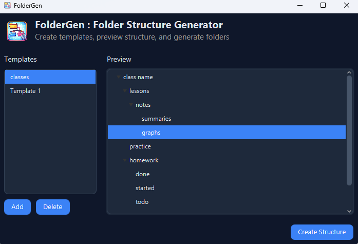
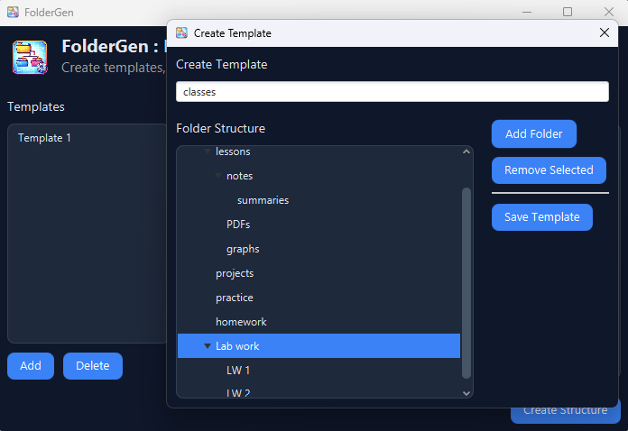

# FolderGen
A simple and modern JavaFX application to create, manage, and generate folder structures using reusable templates.


---

## Features

- Create custom folder structure templates  
- Visual preview with TreeView  
- Add / remove / rename folders  
- Save templates as JSON  
- Load and reuse templates  
- Generate full folder structures anywhere on your system  
- Edit templates via modal (double-click support)  

---

## UI Preview

> Clean and minimal interface built with JavaFX + CSS

- Sidebar for templates  
- Live structure preview  
- Modal-based template editor  



---

## Getting Started

### 1. Clone the repository

```bash
git clone https://github.com/your-username/foldergen.git
cd foldergen
```

---

### 2. Run the application

Make sure you have:
- Java 21+
- JavaFX configured

Then run:

```bash
mvn clean javafx:run
```

or launch from your IDE.

---

## How It Works

### Templates

Templates are stored as `.json` files:

```json
{
  "name": "MyTemplate",
  "root": {
    "name": "Root",
    "children": [
      { "name": "src", "children": [] },
      { "name": "docs", "children": [] }
    ]
  }
}
```

---

### Folder Generation

- Select a template  
- Choose a destination folder  
- FolderGen recreates the structure instantly  

---

## Project Structure

```
src/
 ├── main/
 │   ├── java/com/example/
 │   │   ├── Controllers/
 │   │   ├── model/
 │   │   ├── utils/
 │   │   └── app/
 │   └── resources/com/example/
 │       ├── style/
 │       ├── icons/
 │       └── *.fxml
```

---

## Tech Stack

- Java 21  
- JavaFX  
- Gson (JSON serialization)  
- FXML + CSS  

---

## Future Improvements

- Inline folder renaming  
- Drag & drop tree editing  
- Import / export templates  
- Different themes UI  
- Custom window styling  

---
## License

This project is open source and available under the MIT License.

---

## Author

Built by MassiZiane

---
